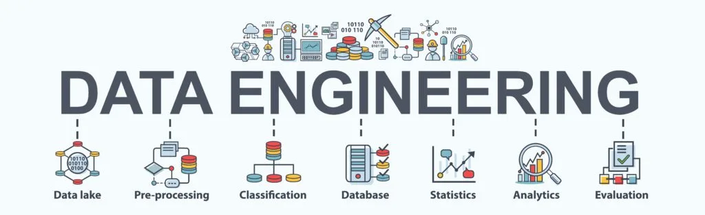

<!--
*** Thanks for checking out the Best-README-Template. If you have a suggestion
*** that would make this better, please fork the repo and create a pull request
*** or simply open an issue with the tag "enhancement".
*** Don't forget to give the project a star!
*** Thanks again! Now go create something AMAZING! :D
-->

<!-- PROJECT SHIELDS -->
<!--
*** I'm using markdown "reference style" links for readability.
*** Reference links are enclosed in brackets [ ] instead of parentheses ( ).
*** See the bottom of this document for the declaration of the reference variables
*** for contributors-url, forks-url, etc. This is an optional, concise syntax you may use.
*** https://www.markdownguide.org/basic-syntax/#reference-style-links
-->

<!-- PROJECT LOGO -->
 

  

  <h3 align="center">DataTalks Data & Analytical Engineering ZoomCamp Project</h3>

  

    A wrap up projects for the completion of the 7 weeks of the ZoomCamp!
     
    <a href="https://github.com/OLAMIDE100/Data-Engineering-Project"><strong>Explore the docs »</strong></a>
     
     
    <a href="https://datastudio.google.com/reporting/003789ac-4a1e-4fa3-b8e7-4e08cc288c2f">View Dashboard</a>
    ·
    <a href="https://github.com/OLAMIDE100/Data-Engineering-Project/issues">Report Bug</a>
  

<!-- TABLE OF CONTENTS -->

  
Table of Contents

  <ol>
    <li>
      <a href="#about-the-project">About The Project</a>
      <ul>
        <li><a href="#built-with">Built With</a></li>
        <li><a href="#architecture">Architecture</a></li>
      </ul>
    </li>
    <li><a href="#usage">Usage</a></li>
    <li><a href="#roadmap">Roadmap</a></li>
    <li><a href="#license">License</a></li>
    <li><a href="#contact">Contact</a></li>
    <li><a href="#acknowledgments">Acknowledgments</a></li>
  </ol>

<!-- ABOUT THE PROJECT -->
## About The Project

  <h1>2023 NIGERIA GENERAL ELECTION POLITICAL ARENA</h1>
  
  
 

There are many great README templates available on GitHub; however, I didn't find one that really suited my needs so I created this enhanced one. I want to create a README template so amazing that it'll be the last one you ever need -- I think this is it.

Here's why:
* Your time should be focused on creating something amazing. A project that solves a problem and helps others
* You shouldn't be doing the same tasks over and over like creating a README from scratch
* You should implement DRY principles to the rest of your life :smile:

Of course, no one template will serve all projects since your needs may be different. So I'll be adding more in the near future. You may also suggest changes by forking this repo and creating a pull request or opening an issue. Thanks to all the people have contributed to expanding this template!

Use the `BLANK_README.md` to get started.

(<a href="#top">back to top</a>)

### Architecture

* [Nigeria Political Tweets](): the dataset we will use during the course.
* [Pandas](https://spark.apache.org/): analytics engine for large-scale data processing (distributed processing).
* [Google BigQuery](https://cloud.google.com/products/bigquery/): serverless _data warehouse_ (central repository of integrated data from one or more disparate sources).
* [Airflow](https://airflow.apache.org/): workflow management platform for data engineering pipelines. In other words, a pipeline orchestration tool.
* [Docker](https://www.docker.com/): a set of platform as a service (PaaS) products that use OS-level virtualization to deliver software in packages called containers.
* [Google Cloud Storage](https://cloud.google.com/storage): a RESTful online file storage web service for storing and accessing data on Google Cloud Platform infrastructure.
* [Google Data Studio](https://datastudio.google.com): Google Data Studio turns your data into fully customizable informative reports and dashboards that are easy to read and share
### Built With

Language, frameworks, libraries, Services and Tools used to bootstrap this project.

* 
* 
* 
* 
* 
* 
* 
* 
* 
* 
* 
* 

(<a href="#top">back to top</a>)

<!-- USAGE EXAMPLES -->
## Usage

_for real time dashboard of our data and with its analysis , please refer to the [Poliical Arena Dashboard](https://datastudio.google.com/reporting/003789ac-4a1e-4fa3-b8e7-4e08cc288c2f)_

(<a href="#top">back to top</a>)

<!-- ROADMAP -->
## Roadmap

- [x] Create a GCP project and Get the google service key and store in a file path
- [x] Install Terraform and create the main.tf and variable.tf file
- [x] Provision the various Google Cloud Resources Using Terraform
- [x] Create an Airflow folder with dags,logs and plugins folders inside it
- [x] Install Docker and Docker Compose
- [x] Add a custom Docker file with airflow image to take in airflow environment, python environment and google development kit/environment
- [x] Build the airflow image
- [x] Add the docker compose file with various airflow services and variables together with google variables
- [x] Build the bash data ingestion script
- [x] Build the dag python file with various operators for the execution off various tasks
- [x] Run the docker compose up to build and start our containers for the execution of the project
- [x] Connect the ingested dataset in the dataware to google data studio
- [x] Build dashboards to pass the necessary information effectively

See the [open issues](https://github.com/OLAMIDE100/Data-Engineering-Project/issues) for a full list of proposed features (and known issues).

(<a href="#top">back to top</a>)

<!-- ACKNOWLEDGMENTS -->
## Acknowledgments

I am extremely grateful for the time this set of wonderful people put in place to ensure we understood the various aspect of data and analytical engineering

* [Alexey Grigorev](https://www.linkedin.com/in/agrigorev/)
* [Ankush Khanna](https://www.linkedin.com/in/ankushkhanna2/)
* [Sejal Vaidya](https://www.linkedin.com/in/vaidyasejal/)
* [Victoria Perez Mola](https://www.linkedin.com/in/victoriaperezmola/)

(<a href="#top">back to top</a>)

<!-- CONTACT -->
## Contact

Your Name - [Adesoba Adewale Olamide](https://www.linkedin.com/in/adesoba-olamide-gmnse-787193169/)

Project Link: [2023 Political Arena](https://github.com/OLAMIDE100/Data-Engineering-Project)

(<a href="#top">back to top</a>)

